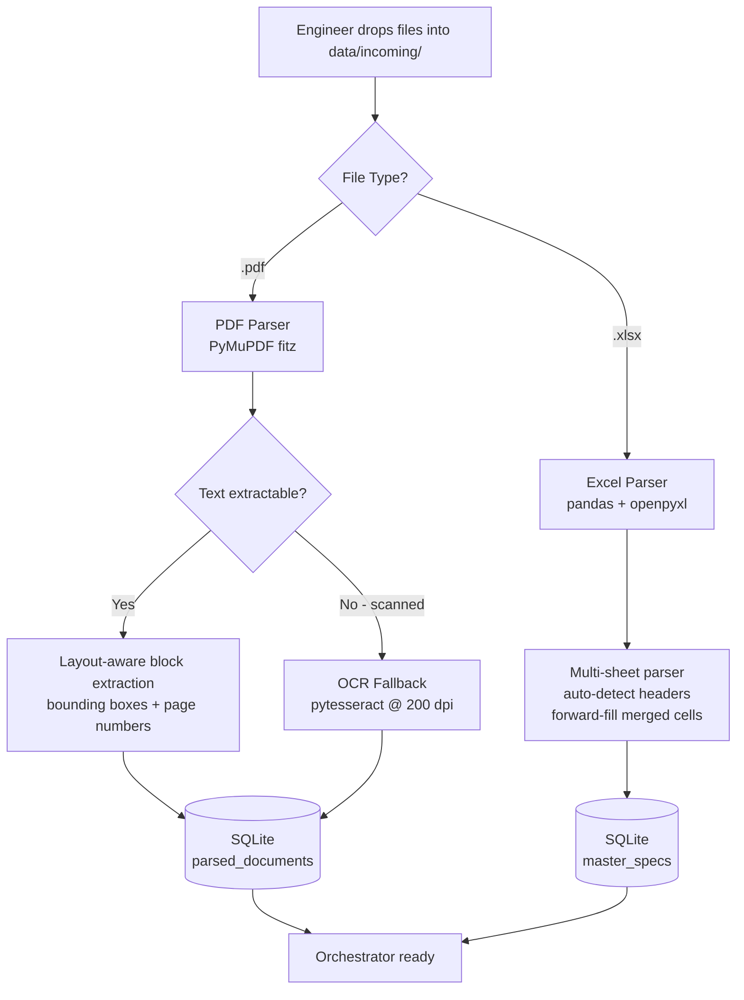
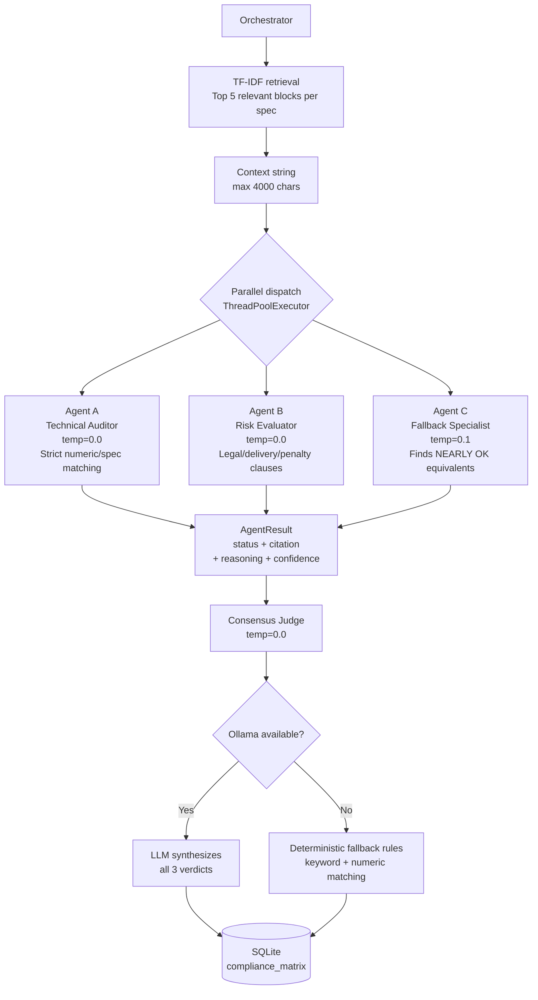
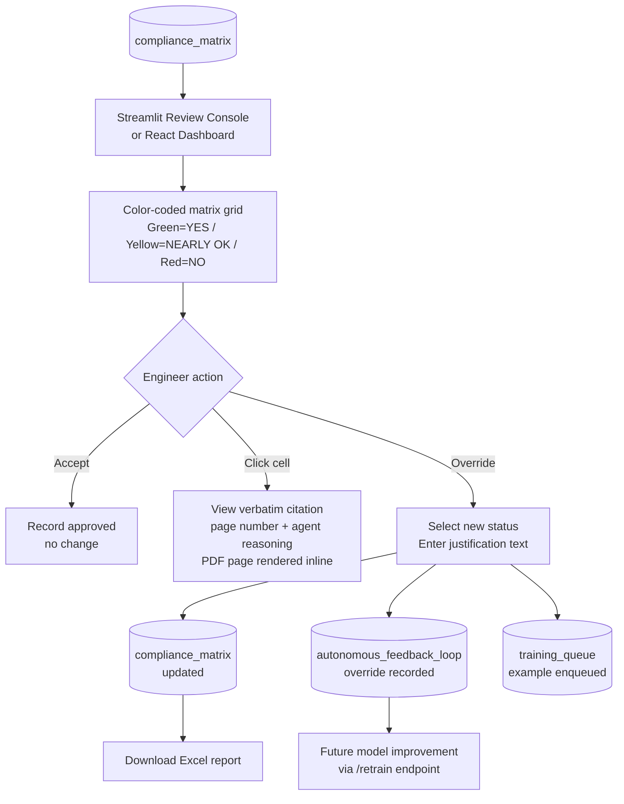
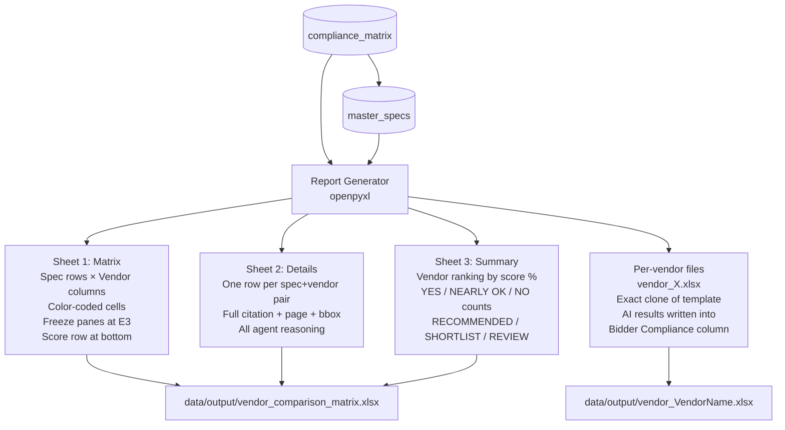
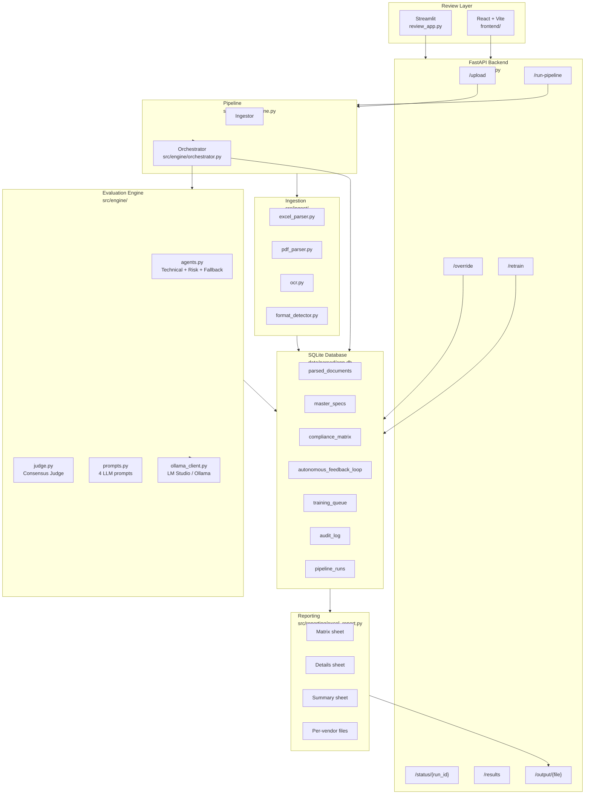
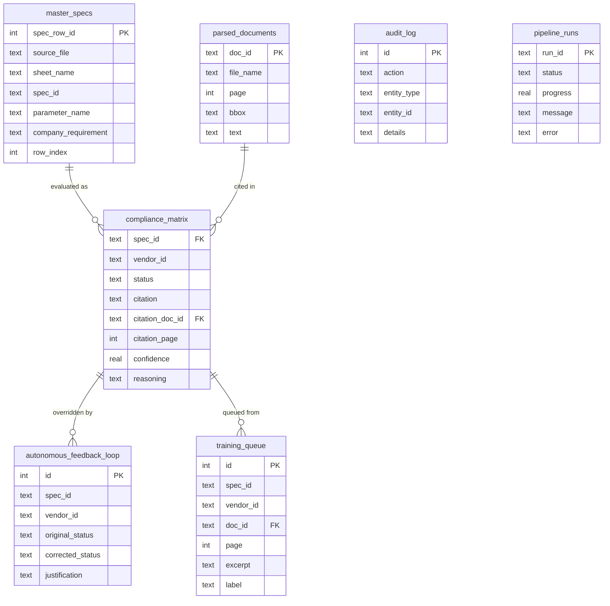
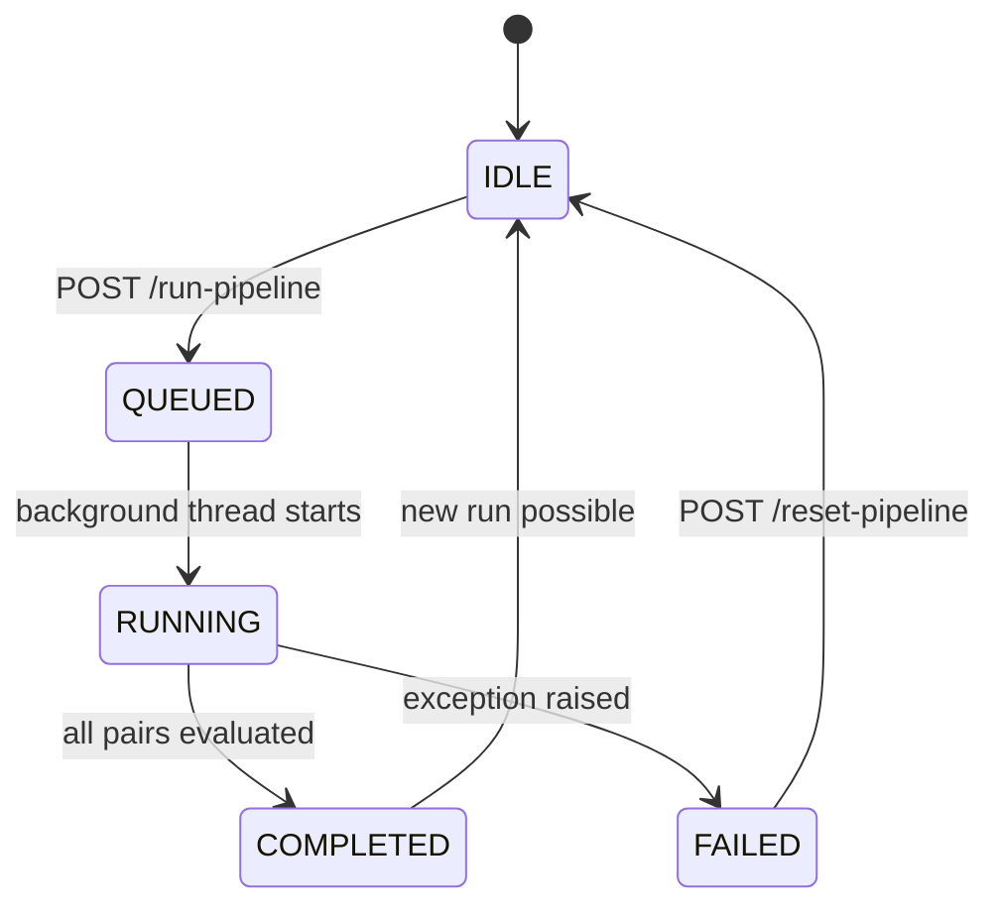
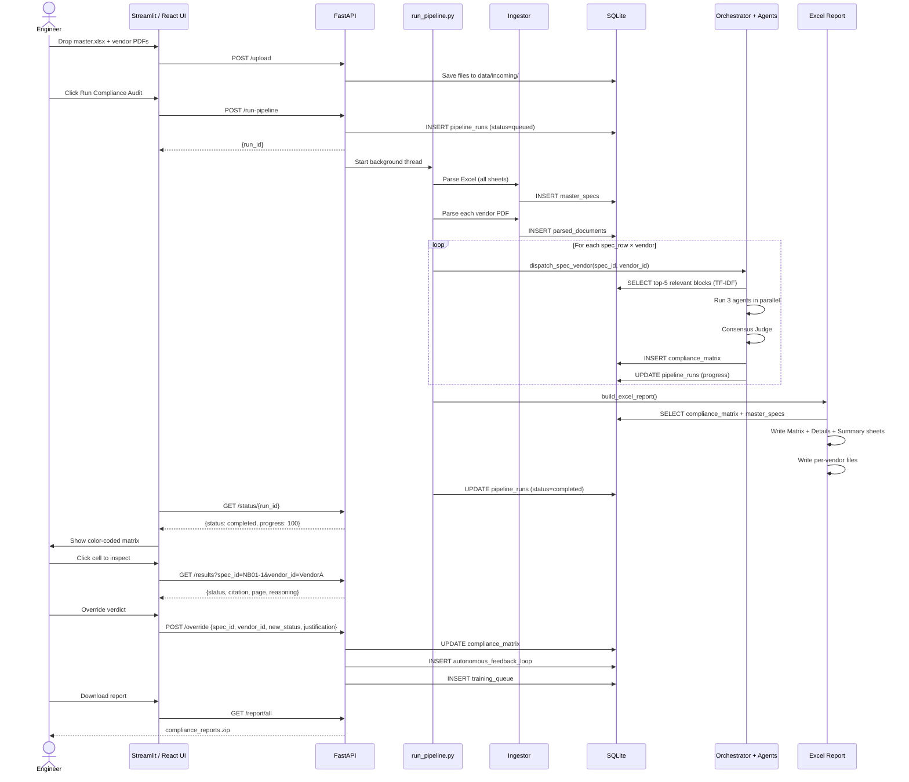
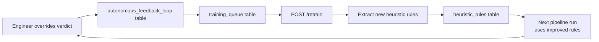

# Tender & Vendor Compliance Platform

> **Turn days of manual government procurement work into 30 minutes of automated, auditable, air-gapped AI analysis — running entirely on the engineer's own machine with zero data leaks.**

---

## Table of Contents

1. [What This Project Does](#1-what-this-project-does)
2. [The Real-World Problem](#2-the-real-world-problem)
3. [System Architecture Overview](#3-system-architecture-overview)
4. [Full Pipeline — How It Works](#4-full-pipeline--how-it-works)
   - [Phase 1 — Secure Ingestion](#phase-1--secure-ingestion--decomposition)
   - [Phase 2 — Multi-Agent AI Council](#phase-2--autonomous-multi-agent-council)
   - [Phase 3 — Human Review Loop](#phase-3--human-in-the-loop-review)
   - [Phase 4 — Report Generation](#phase-4--report-generation)
5. [Component Diagram](#5-component-diagram)
6. [Database Schema](#6-database-schema)
7. [API Reference](#7-api-reference)
8. [Repository Layout](#8-repository-layout)
9. [Technology Stack](#9-technology-stack)
10. [Quick Start](#10-quick-start)
11. [Running Each Service](#11-running-each-service)
12. [Output — The Excel Report](#12-output--the-excel-report)
13. [Security & Air-Gap Guarantees](#13-security--air-gap-guarantees)
14. [Configuration](#14-configuration)
15. [Tests](#15-tests)

---

## 1. What This Project Does

This platform automates government procurement compliance auditing. A procurement engineer normally spends **days** manually reading hundreds of pages of vendor PDF proposals and cross-checking them against a master specification Excel sheet. This platform reduces that to **under 30 minutes**.

The engineer:
1. Drops one master spec Excel file and up to 10 vendor PDFs into a folder.
2. Clicks **Run Compliance Audit**.
3. Gets back a color-coded Excel matrix — every spec row evaluated against every vendor, with verbatim citations and page numbers.
4. Reviews, overrides if needed, and downloads the final report.

Everything runs **100% locally**. No internet. No cloud. No data leaves the machine.

---

## 2. The Real-World Problem

### What the engineer receives

| File | Description |
|------|-------------|
| **Master Spec Excel** | 10–50 sheets. Each sheet = one product (e.g. `NB01`, `PC01`, `WS01`, `Projector`). Each row = one technical requirement. |
| **Vendor PDFs** | Up to 10 proposals, each 200–400 pages of datasheets, certificates, test reports, delivery terms, and warranty clauses. |

### What the engineer must do manually (before this platform)

For every spec row × every vendor PDF, the engineer reads, judges, and writes:

- ✅ **YES** — vendor explicitly meets the requirement
- 🟡 **NEARLY OK** — vendor partially meets it or uses an equivalent
- ❌ **NO** — vendor does not meet it or did not mention it

Then compiles everything into a comparison Excel matrix. This takes **days per tender**.

### What this platform does instead

```
Engineer drops files → AI evaluates every pair → Color-coded matrix appears
→ Engineer reviews & overrides → Downloads final Excel report
```

---

## 3. System Architecture Overview

```
┌─────────────────────────────────────────────────────────────────────────┐
│                        LOCAL MACHINE (Air-Gapped)                       │
│                                                                         │
│  ┌──────────────┐    ┌──────────────────────────────────────────────┐   │
│  │  data/       │    │              PIPELINE ENGINE                 │   │
│  │  incoming/   │───▶│                                              │   │
│  │              │    │  ┌──────────┐  ┌──────────┐  ┌──────────┐   │   │
│  │  master.xlsx │    │  │  Excel   │  │  PDF     │  │  OCR     │   │   │
│  │  vendor1.pdf │    │  │  Parser  │  │  Parser  │  │ Fallback │   │   │
│  │  vendor2.pdf │    │  │(pandas + │  │(PyMuPDF) │  │(tesser-  │   │   │
│  │  ...         │    │  │openpyxl) │  │          │  │  act)    │   │   │
│  └──────────────┘    │  └────┬─────┘  └────┬─────┘  └────┬─────┘   │   │
│                      │       └──────────────┴─────────────┘         │   │
│                      │                    │                          │   │
│                      │             ┌──────▼──────┐                  │   │
│                      │             │   SQLite DB  │                  │   │
│                      │             │  (WAL mode)  │                  │   │
│                      │             └──────┬──────┘                  │   │
│                      │                    │                          │   │
│                      │        ┌───────────▼──────────┐              │   │
│                      │        │    ORCHESTRATOR       │              │   │
│                      │        │  (TF-IDF retrieval)   │              │   │
│                      │        └───────────┬──────────┘              │   │
│                      │          ┌─────────┼─────────┐               │   │
│                      │    ┌─────▼──┐ ┌───▼────┐ ┌──▼──────┐        │   │
│                      │    │Agent A │ │Agent B │ │Agent C  │        │   │
│                      │    │Tech    │ │Risk    │ │Fallback │        │   │
│                      │    │Auditor │ │Eval.   │ │Spec.    │        │   │
│                      │    └─────┬──┘ └───┬────┘ └──┬──────┘        │   │
│                      │          └─────────┼─────────┘               │   │
│                      │               ┌────▼────┐                    │   │
│                      │               │  Judge  │                    │   │
│                      │               │Consensus│                    │   │
│                      │               └────┬────┘                    │   │
│                      └────────────────────┼─────────────────────────┘   │
│                                           │                             │
│  ┌────────────────────┐    ┌──────────────▼──────────────────────────┐  │
│  │  data/output/      │◀───│         REPORT GENERATOR                │  │
│  │  matrix.xlsx       │    │  (openpyxl — Matrix + Details + Summary)│  │
│  └────────────────────┘    └─────────────────────────────────────────┘  │
│                                                                         │
│  ┌─────────────────────────────────────────────────────────────────┐    │
│  │  REVIEW LAYER                                                   │    │
│  │  Streamlit UI  ←→  FastAPI  ←→  React Dashboard                │    │
│  │  (human overrides, citations, PDF viewer, download)             │    │
│  └─────────────────────────────────────────────────────────────────┘    │
└─────────────────────────────────────────────────────────────────────────┘
```

---

## 4. Full Pipeline — How It Works

### Phase 1 — Secure Ingestion & Decomposition



**What happens in detail:**

- The **Excel parser** scans all sheets (NB01, PC01, WS01, etc.), auto-detects the header row by scanning the first 15 rows, forward-fills merged cells, and extracts every spec row as a `SpecRow` with a generated ID like `NB01-1`, `NB01-2`.
- The **PDF parser** uses PyMuPDF to extract layout-aware text blocks with bounding-box coordinates `[x0, y0, x1, y1]` and page numbers, sorted top-to-bottom left-to-right to handle 2-column layouts.
- The **OCR fallback** rasterizes scanned pages at 200 dpi and runs pytesseract when PyMuPDF finds no extractable text.
- All parsed content is committed transactionally to SQLite.

---

### Phase 2 — Autonomous Multi-Agent Council



**The three agents:**

| Agent | Role | Temperature | Focus |
|-------|------|-------------|-------|
| **Technical Auditor** | Strict compliance check | `0.0` (deterministic) | Numeric values, material grades, processor specs, memory sizes, standards |
| **Risk Evaluator** | Commercial & legal check | `0.0` (deterministic) | Delivery timelines, penalty clauses, warranty terms, regulatory frameworks |
| **Fallback Specialist** | Equivalence finder | `0.1` (slightly lenient) | Alternative configurations, equivalent standards, implied compliance |
| **Consensus Judge** | Final verdict | `0.0` (deterministic) | Synthesizes all 3 results, cross-checks citations, resolves contradictions |

**Every verdict stores:**
- `status` — YES / NO / NEARLY OK
- `citation` — verbatim text from the vendor PDF
- `citation_page` — page number
- `citation_bbox` — bounding box coordinates
- `reasoning` — agent's explanation
- `confidence` — 0.0 to 1.0 score

**Heuristic fallback** (when Ollama is not installed): keyword matching + numeric value extraction runs deterministically so the pipeline always produces results.

---

### Phase 3 — Human-in-the-Loop Review



**What the engineer can do in the review console:**
- See the full color-coded matrix at a glance.
- Click any cell to read the verbatim citation, page number, and all three agent reasoning chains.
- Render the actual PDF page inline to verify the citation.
- Override any verdict with a justification — the override is immediately saved and logged.
- Filter by product sheet, compliance status, or vendor.
- Download the final Excel report.

Every override feeds the **autonomous feedback loop** — corrections are stored and can be used to improve the heuristic rules via the `/retrain` API endpoint.

---

### Phase 4 — Report Generation



**Scoring logic:**
- YES = 2 points
- NEARLY OK = 1 point
- NO = 0 points
- Score % = `(total points / max possible points) × 100`
- Recommendation: **RECOMMENDED** ≥ 85% | **SHORTLIST** ≥ 70% | **REVIEW** < 70%

---

## 5. Component Diagram



---

## 6. Database Schema

The platform uses a single SQLite database at `data/parsed/app.db` with WAL mode, foreign key enforcement, and `secure_delete ON`.

```
┌─────────────────────────────────────────────────────────────────────────┐
│                         DATABASE TABLES                                 │
├──────────────────────┬──────────────────────────────────────────────────┤
│ parsed_documents     │ PDF text blocks with page + bounding box coords  │
│ master_specs         │ All rows from all sheets of the master Excel      │
│ compliance_matrix    │ Final YES/NO/NEARLY OK verdict per (spec, vendor) │
│ autonomous_feedback  │ Human overrides with original + corrected status  │
│ training_queue       │ Override examples queued for model improvement    │
│ audit_log            │ Every pipeline action logged with timestamp       │
│ pipeline_runs        │ Run history: run_id, status, progress, error      │
│ application_users    │ Local user accounts                               │
│ format_profiles      │ Detected Excel format profiles per sheet          │
│ heuristic_rules      │ Keyword rules for the deterministic fallback      │
└──────────────────────┴──────────────────────────────────────────────────┘
```

### Entity Relationship



---

## 7. API Reference

The FastAPI backend runs at `http://127.0.0.1:8088` by default. All endpoints are restricted to localhost and private LAN addresses (RFC-1918) — no public internet access.

### Core Endpoints

| Method | Endpoint | Description |
|--------|----------|-------------|
| `GET` | `/health` | Server health check |
| `GET` | `/ollama-status` | Check Ollama/LM Studio connectivity and available models |
| `GET` | `/me` | Current user info |

### File Management

| Method | Endpoint | Description |
|--------|----------|-------------|
| `GET` | `/files` | List files in `data/incoming/` |
| `POST` | `/upload` | Upload master Excel + vendor PDFs (multipart, max 200 MB each) |
| `GET` | `/pdf/{file_name}` | Serve a vendor PDF for inline viewing |

### Pipeline Control

| Method | Endpoint | Description |
|--------|----------|-------------|
| `POST` | `/run-pipeline` | Start the compliance pipeline (returns `run_id`) |
| `POST` | `/reset-pipeline` | Clear stuck running/queued runs |
| `GET` | `/runs` | List all pipeline runs (paginated) |
| `GET` | `/runs/{run_id}` | Get status of a specific run |
| `GET` | `/status/{run_id}` | Alias for run status |

### Results & Review

| Method | Endpoint | Description |
|--------|----------|-------------|
| `GET` | `/results` | Query compliance matrix (filter by vendor, spec, status) |
| `GET` | `/summary` | Aggregated counts by status, vendor, spec |
| `GET` | `/parsed-document/{doc_id}` | Retrieve a specific parsed PDF block |
| `POST` | `/override` | Submit a human override with justification |
| `GET` | `/audit-log` | Full audit trail of all actions |
| `GET` | `/training-queue` | View queued training examples from overrides |

### Reports & Download

| Method | Endpoint | Description |
|--------|----------|-------------|
| `GET` | `/output-files` | List all generated Excel files |
| `GET` | `/output/{file_name}` | Download a specific output file |
| `GET` | `/report/vendor/{vendor_id}` | Download per-vendor compliance file |
| `GET` | `/report/all` | Download ZIP of all output files |

### Learning & Rules

| Method | Endpoint | Description |
|--------|----------|-------------|
| `POST` | `/retrain` | Process override queue and extract new heuristic rules |
| `GET` | `/heuristic-rules` | List all active heuristic rules |
| `POST` | `/heuristic-rules` | Manually add a heuristic rule |
| `GET` | `/format-profiles` | List detected Excel format profiles |

### Pipeline State Machine



---

## 8. Repository Layout

```
vendor/
│
├── src/                          # All Python source code
│   ├── app/
│   │   ├── api.py                # FastAPI application — all REST endpoints
│   │   └── run_pipeline.py       # Full pipeline runner (ingest → evaluate → report)
│   │
│   ├── engine/                   # AI evaluation engine
│   │   ├── agents.py             # Technical, Risk, and Fallback agents
│   │   ├── judge.py              # Consensus Judge — synthesizes 3 agent verdicts
│   │   ├── orchestrator.py       # TF-IDF retrieval + parallel agent dispatch
│   │   ├── prompts.py            # 4 LLM prompt templates (JSON-only output)
│   │   └── ollama_client.py      # Ollama / LM Studio client with caching
│   │
│   ├── ingest/
│   │   ├── excel_parser.py       # Multi-sheet Excel parser, merged-cell aware
│   │   ├── excel_loader.py       # Low-level Excel loading utilities
│   │   ├── pdf_parser.py         # PyMuPDF block extraction with bbox + page
│   │   ├── ocr.py                # pytesseract OCR fallback at 200 dpi
│   │   └── format_detector.py    # Auto-detects Excel column layout per sheet
│   │
│   ├── reporting/
│   │   └── excel_report.py       # Builds Matrix + Details + Summary + per-vendor files
│   │
│   ├── storage/
│   │   ├── db.py                 # SQLite connection (WAL, FK, secure_delete)
│   │   └── schema.sql            # All table definitions and indexes
│   │
│   ├── ui/
│   │   └── review_app.py         # Streamlit review console
│   │
│   ├── utils/
│   │   ├── logging.py            # Structured logging helpers
│   │   └── paths.py              # PROJECT_ROOT and path constants
│   │
│   └── evaluator.py              # MultiAgentEvaluator with heuristic fallback
│
├── frontend/                     # React + Vite dashboard
│   ├── src/
│   │   ├── App.jsx               # Main React application
│   │   └── styles.css            # Dashboard styles
│   └── package.json
│
├── data/
│   ├── incoming/                 # ← DROP YOUR FILES HERE
│   │   ├── Tech_Comp_check_list.xlsx   (master spec)
│   │   ├── vendor1.pdf
│   │   └── vendor2.pdf ...
│   ├── parsed/
│   │   └── app.db                # SQLite database (auto-created)
│   └── output/
│       ├── vendor_comparison_matrix.xlsx   (summary report)
│       └── vendor_VendorName.xlsx          (per-vendor reports)
│
├── config/
│   └── settings.example.yaml     # All configurable paths and model settings
│
├── scripts/
│   ├── bootstrap.ps1             # Windows setup: venv + deps + sample data
│   ├── bootstrap.sh              # Linux/Mac setup
│   ├── run_api.ps1               # Start FastAPI server
│   ├── run_pipeline.ps1          # Run pipeline directly
│   ├── run_review.ps1            # Start Streamlit UI
│   ├── generate_sample_data.py   # Create test Excel + vendor PDFs
│   └── test_ollama.py            # Verify Ollama connectivity
│
├── tests/                        # pytest test suite
├── requirements.txt              # Pinned production dependencies
├── requirements-dev.txt          # Dev/test dependencies
└── README.md                     # This file
```

---

## 9. Technology Stack

| Layer | Technology | Why |
|-------|-----------|-----|
| **Language** | Python 3.11+ | Mature ecosystem, strong data/AI libraries |
| **PDF Parsing** | PyMuPDF (fitz) | Layout-aware bounding-box extraction, fast |
| **PDF Tables** | pdfplumber | Fallback for complex table-heavy PDFs |
| **OCR** | pytesseract + Tesseract | Handles scanned/image-only vendor PDFs |
| **Excel I/O** | pandas + openpyxl | Multi-sheet, merged-cell aware parsing and writing |
| **Local LLM** | Ollama / LM Studio | Runs llama3 or any GGUF model fully offline |
| **Retrieval** | TF-IDF (pure Python) | No vector DB needed — fully local, no extra deps |
| **Database** | SQLite (WAL mode) | Zero-config, transactional, single-file, air-gapped |
| **API** | FastAPI + uvicorn | Fast async REST API, auto-generated docs |
| **Review UI** | Streamlit | Rapid internal tool, drag-and-drop, PDF viewer |
| **Dashboard** | React + Vite | Dynamic browser UI for matrix review |
| **Report** | openpyxl | Styled 3-sheet Excel with color coding |

### Hardware Requirements

| Model Size | RAM | GPU VRAM | Notes |
|-----------|-----|----------|-------|
| 8B model | 16 GB | Optional | CPU inference works, slower |
| 70B model | 64 GB | 24 GB+ | GPU strongly recommended |
| Heuristic only | 4 GB | None | No Ollama needed at all |

---

## 10. Quick Start

### Prerequisites

- Python 3.11+
- [Tesseract OCR](https://github.com/UB-Mannheim/tesseract/wiki) installed and on PATH (for scanned PDFs)
- [Ollama](https://ollama.com) installed with a model pulled (optional — heuristic fallback works without it)

### Windows (PowerShell)

```powershell
# 1. Clone and enter the project
cd vendor

# 2. Bootstrap: creates venv, installs deps, creates data dirs, generates sample data
.\scripts\bootstrap.ps1 -InstallDevDependencies -GenerateSampleData

# 3. Activate the virtual environment
.\.venv\Scripts\Activate.ps1

# 4. Start the review UI
streamlit run src/ui/review_app.py
```

### Linux / macOS / Git Bash / WSL

```bash
# 1. Bootstrap
bash scripts/bootstrap.sh

# 2. Activate venv
source .venv/bin/activate

# 3. Start the review UI
streamlit run src/ui/review_app.py
```

### Manual install (any OS)

```bash
python -m venv .venv
source .venv/bin/activate          # Windows: .venv\Scripts\activate
pip install --upgrade pip
pip install -r requirements.txt

# Create required directories
mkdir -p data/incoming data/parsed data/output
```

---

## 11. Running Each Service

### Step 1 — Drop your files

Place exactly **one** master spec Excel and **one or more** vendor PDFs into `data/incoming/`:

```
data/incoming/
├── Tech_Comp_check_list.xlsx    ← master spec (required)
├── Vendor_ABC.pdf               ← vendor proposal
├── Vendor_XYZ.pdf               ← vendor proposal
└── ...
```

### Step 2 — Run the pipeline

**Option A: Via the Streamlit UI (recommended for beginners)**
```powershell
streamlit run src/ui/review_app.py
```
Open `http://localhost:8501` in your browser, upload files, and click **Run Compliance Audit**.

**Option B: Via command line**
```powershell
python -m src.app.run_pipeline
```

**Option C: Via the FastAPI backend**
```powershell
# Start the API server
uvicorn src.app.api:app --host 127.0.0.1 --port 8088 --reload

# In another terminal, trigger the pipeline
curl -X POST http://127.0.0.1:8088/run-pipeline

# Poll for status
curl http://127.0.0.1:8088/status/<run_id>
```

Or use the PowerShell scripts:
```powershell
.\scripts\run_api.ps1          # Start FastAPI
.\scripts\run_pipeline.ps1     # Run pipeline directly
.\scripts\run_review.ps1       # Start Streamlit
```

### Step 3 — Review results

Open the Streamlit console at `http://localhost:8501` or the React dashboard:

```powershell
cd frontend
npm install
npm run dev
# Opens at http://localhost:5173
```

The React dashboard expects the FastAPI backend at `http://127.0.0.1:8088`. Override with:
```powershell
$env:VITE_API_BASE_URL = "http://10.5.51.82:8088"
npm run dev
```

### Step 4 — Download the report

The report is written to `data/output/vendor_comparison_matrix.xlsx`.

Download via:
- Streamlit UI download button
- `GET http://127.0.0.1:8088/report/all` (ZIP of all output files)
- `GET http://127.0.0.1:8088/output/vendor_comparison_matrix.xlsx`

### Verify Ollama is working

```powershell
python scripts/test_ollama.py
# or
curl http://127.0.0.1:8088/ollama-status
```

---

## 12. Output — The Excel Report

The platform generates two types of output files:

### `vendor_comparison_matrix.xlsx` — Summary Report

**Sheet 1: Matrix**
```
┌──────────┬────────────────┬──────────────────────────┬──────────┬──────────┬──────────┐
│ spec_id  │ parameter_name │ company_requirement       │ Vendor A │ Vendor B │ Vendor C │
├──────────┼────────────────┼──────────────────────────┼──────────┼──────────┼──────────┤
│ NB01-1   │ Processor      │ min 8 cores, 4.7GHz turbo│  YES 🟢  │  NO  🔴  │NEARLY 🟡 │
│ NB01-2   │ RAM            │ 16GB DDR5 minimum        │  YES 🟢  │  YES 🟢  │  NO  🔴  │
│ ...      │ ...            │ ...                      │  ...     │  ...     │  ...     │
├──────────┼────────────────┼──────────────────────────┼──────────┼──────────┼──────────┤
│ SCORE    │                │                          │   42     │   28     │   35     │
└──────────┴────────────────┴──────────────────────────┴──────────┴──────────┴──────────┘
```
- Freeze panes at column E, row 3
- Green = YES, Yellow = NEARLY OK, Red = NO
- Score row at the bottom (YES=2pts, NEARLY OK=1pt, NO=0pts)

**Sheet 2: Details**

One row per (spec, vendor) pair with full citation, page number, bounding box, and all agent reasoning.

**Sheet 3: Summary**

```
┌──────────┬────────┬──────────┬────────┬───────────┬──────────────┐
│ vendor   │  YES   │ NEARLY OK│   NO   │  Score %  │ Recommendation│
├──────────┼────────┼──────────┼────────┼───────────┼──────────────┤
│ Vendor A │   38   │    4     │   8    │   88.0%   │ RECOMMENDED  │
│ Vendor C │   30   │   10     │  10    │   70.0%   │ SHORTLIST    │
│ Vendor B │   22   │    6     │  22    │   50.0%   │ REVIEW       │
└──────────┴────────┴──────────┴────────┴───────────┴──────────────┘
```

### `vendor_VendorName.xlsx` — Per-Vendor Report

An exact clone of the original `Tech_Comp_check_list.xlsx` template with AI results written directly into the **Bidder's Compliance (Y/N)**, **Remarks**, and **Page No.** columns — preserving all merged cells, styles, and layout.

---

## 13. Security & Air-Gap Guarantees

This platform is designed for **zero network egress**. Here is what is enforced:

| Control | Implementation |
|---------|---------------|
| **No external API calls** | All LLM inference via local Ollama/LM Studio only |
| **Localhost-only API** | FastAPI rejects requests from non-private IP addresses |
| **LAN access control** | Only RFC-1918 private addresses allowed (`10.x`, `172.16-31.x`, `192.168.x`) |
| **File size cap** | Max 200 MB per upload to prevent resource exhaustion |
| **File type validation** | Only `.pdf` and `.xlsx` accepted |
| **Path traversal prevention** | All file names sanitized before disk writes |
| **Transactional DB writes** | All SQLite writes use transactions — partial runs are recoverable |
| **WAL mode** | SQLite Write-Ahead Logging for crash safety |
| **secure_delete ON** | Deleted SQLite rows are overwritten with zeros |
| **Audit log** | Every override and pipeline action is logged with timestamp |
| **No credentials in code** | Auth uses environment variables only |

---

## 14. Configuration

### Environment Variables

| Variable | Default | Description |
|----------|---------|-------------|
| `OLLAMA_HOST` | `http://127.0.0.1:11434` | Ollama server URL |
| `OLLAMA_MODEL` | auto-detected | Model name to use (e.g. `llama3`, `llama3:70b`) |
| `OLLAMA_WARMUP` | `1` | Set to `0` to skip model warmup on API start |
| `ALLOWED_HOSTS` | `127.0.0.1` | Comma-separated IPs allowed to call the API |
| `MAX_UPLOAD_MB` | `200` | Maximum file upload size in megabytes |
| `LLM_BACKEND` | `ollama` | LLM backend to use (`ollama` or `lmstudio`) |

### `config/settings.example.yaml`

Copy to `config/settings.yaml` and adjust:

```yaml
paths:
  incoming: data/incoming
  parsed: data/parsed
  output: data/output

model:
  name: llama3
  temperature_strict: 0.0
  temperature_lenient: 0.1

ocr:
  enabled: true
  dpi: 200

pipeline:
  max_spec_rows: 50
  max_vendors: 10
  max_context_chars: 4000
  top_k_blocks: 5
```

---

## 15. Tests

```powershell
# Run all tests
python -m pytest -q tests/

# Run a specific test file
python -m pytest tests/test_excel_parser.py -v

# Run with coverage
python -m pytest --cov=src tests/
```

### Test Coverage

| Test File | What It Tests |
|-----------|--------------|
| `tests/test_excel_parser.py` | Multi-sheet parsing, merged cells, missing columns |
| `tests/test_pdf_parser.py` | Block extraction, sort order, OCR fallback |
| `tests/test_heuristic_agent.py` | YES/NO/NEARLY OK classification with known inputs |
| `tests/test_pipeline.py` | End-to-end integration with sample data |
| `tests/test_excel_report.py` | 3-sheet output, correct colors, correct data |

### Generate sample test data

```powershell
python scripts/generate_sample_data.py
# Creates: data/incoming/sample_master.xlsx + data/incoming/sample_vendor_1.pdf
```

---

## Sequence Diagram — Full Run



---

## Continuous Learning Loop



Every time an engineer corrects a verdict, the correction is stored. Calling `/retrain` processes the queue and extracts new keyword rules that immediately improve the heuristic evaluator for the next run — no model retraining required.

---

*Built for government procurement compliance auditing. 100% local. Zero data leaks. Every verdict has a citation.*
