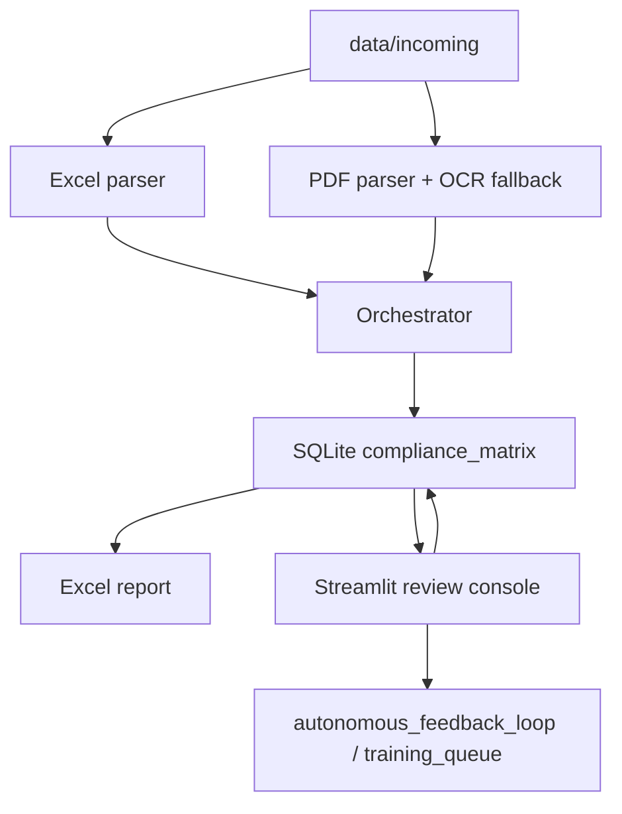

# Tender & Vendor Compliance Platform

Local-first Python tooling for company-style procurement compliance review.
It parses a master spec workbook and vendor PDFs, evaluates each spec/vendor pair,
stores the results in SQLite, generates a color-coded Excel report, and provides a
Streamlit review console for human overrides.

## What it does
- Parses the master Excel checklist and normalizes sheet-based spec rows.
- Extracts layout-aware text blocks from vendor PDFs with PyMuPDF.
- Falls back to OCR when needed.
- Runs a multi-agent compliance evaluation pipeline with heuristic fallback.
- Optionally enriches fallback checks with a web search API and can fall back to Grok when Ollama is unavailable.
- Persists verdicts, citations, feedback, and run history in SQLite.
- Builds a downloadable Excel report with Matrix, Details, and Summary sheets.
- Exposes a JWT-protected FastAPI interface for uploads, pipeline runs, results, and report download.
- Provides a Streamlit review console for manual review and overrides.
- Provides a React/Vite review dashboard for a more dynamic browser UI.

## Repository Layout
- `src/app/` - FastAPI app and pipeline runner.
- `src/engine/` - prompts, agents, judge, and orchestrator.
- `src/ingest/` - Excel, PDF, and OCR ingestion.
- `src/reporting/` - Excel report builder.
- `src/storage/` - SQLite setup and schema.
- `src/ui/` - Streamlit review console.
- `frontend/` - React + Vite dashboard implemented with JSX.
- `src/utils/` - logging and path helpers.
- `data/incoming/` - drop the master workbook and vendor PDFs here.
- `data/parsed/` - SQLite database output.
- `data/output/` - generated Excel report.

## Quick Start
### Windows PowerShell
```powershell
scripts\bootstrap.ps1 -InstallDevDependencies -GenerateSampleData
streamlit run src/ui/review_app.py
```

### Bash / Git Bash / WSL
```bash
bash scripts/bootstrap.sh
streamlit run src/ui/review_app.py
```

## Run the pipeline
After placing files into `data/incoming/`, run:

```powershell
python -m src.app.run_pipeline
```

The report is written to `data/output/vendor_comparison_matrix.xlsx`.

## Run the API
```powershell
uvicorn src.app.api:app --reload
```

Auth is JWT-based. Use `POST /token` to get a bearer token, then call the protected endpoints:
- `POST /upload`
- `POST /run-pipeline`
- `GET /status/{run_id}`
- `GET /results`
- `GET /report`

## Run the review UI
```powershell
streamlit run src/ui/review_app.py
```

Set `REVIEW_TOKEN` or `SECRET_KEY` before starting if you want the review console gated.

## Run the React UI
```powershell
cd frontend
npm install
npm run dev
```

The app expects the FastAPI backend at `http://127.0.0.1:8000` by default.
If your API runs elsewhere, set `VITE_API_BASE_URL` before starting Vite.

## Tests
```powershell
python -m pytest -q tests
```

## Architecture


## Data model
The current schema includes:
- `parsed_documents`
- `master_specs`
- `compliance_matrix`
- `autonomous_feedback_loop`
- `training_queue`
- `audit_log`
- `pipeline_runs`
- React frontend in `frontend/` for the browser-based review dashboard.

## Security and local-first behavior
- SQLite uses WAL, foreign keys, and secure_delete.
- PDF size is capped by `MAX_PDF_BYTES`.
- API and review access use local auth tokens/JWT.
- The default fallback path is still fully local. If you set `WEB_SEARCH_API_URL` or `XAI_API_KEY`, the system can optionally consult those services for equivalence checks and AI fallback.

## Optional environment variables
- `WEB_SEARCH_API_URL` - search API endpoint for equivalence evidence.
- `WEB_SEARCH_API_KEY` - key for the search API.
- `WEB_SEARCH_API_HEADER` - override search auth header name.
- `WEB_SEARCH_API_TIMEOUT` - search request timeout in seconds.
- `XAI_API_KEY` - Grok / xAI API key.
- `XAI_API_BASE` - Grok API base URL.
- `XAI_API_TIMEOUT` - Grok request timeout in seconds.

## Helpful files
- [scripts/bootstrap.ps1](scripts/bootstrap.ps1)
- [scripts/bootstrap.sh](scripts/bootstrap.sh)
- [src/app/run_pipeline.py](src/app/run_pipeline.py)
- [src/ui/review_app.py](src/ui/review_app.py)
- [src/reporting/excel_report.py](src/reporting/excel_report.py)
- [src/storage/schema.sql](src/storage/schema.sql)
