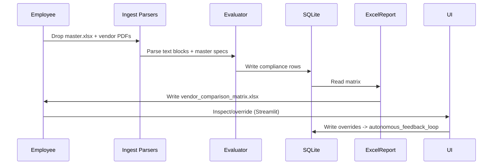

# Vendor Comparison Platform (Local)

A small, local-first tool to parse vendor PDF proposals and a master Excel checklist, evaluate compliance using a multi-agent evaluator (or simple heuristics), persist results to a local SQLite store, and generate a styled Excel comparison matrix. It includes an optional Streamlit review console for human-in-the-loop overrides.

**Key goals:** secure local processing, layout-aware PDF parsing, repeatable evaluation, and a simple human review loop.

## Quick Start (Windows)
- Install Python dependencies:

```powershell
pip install -r requirements.txt
```

- Prepare input files in `data/incoming/`:
	- A master checklist Excel (`*.xlsx`) with columns like `Spec_ID`, `Parameter_Name`, `BHEL_Requirement`.
	- Vendor proposal PDFs (`*.pdf`).

- Run the pipeline (PowerShell script or directly):

```powershell
# using provided script
scripts\run_pipeline.ps1

# or directly
python -m src.main
```

- To view the review console (Streamlit):

```powershell
streamlit run src/ui/review_app.py
```

## Files & Structure
- `src/app/` — FastAPI app and pipeline entrypoint helpers.
- `src/ingest/` — `excel_parser.py`, `pdf_parser.py` (PyMuPDF) for layout-aware extraction.
- `src/evaluator.py` — `MultiAgentEvaluator` (uses Ollama if installed; falls back to simple heuristics).
- `src/storage/` — SQLite initialization and `schema.sql`.
- `src/reporting/` — build a styled Excel `vendor_comparison_matrix.xlsx` using `openpyxl`/`pandas`.
- `src/ui/` — Streamlit-based review console for overrides and feedback loop.
- `src/utils/` — small helpers for logging and paths.

## Architecture (High-level)
The following Mermaid diagrams show the main components and the evaluation sequence.

### Component Diagram

```mermaid
flowchart TB
	A[Incoming files\n(data/incoming)] --> B[Ingest Parsers\n(excel_parser, pdf_parser)]
	B --> C[Evaluator\n(MultiAgentEvaluator)]
	C --> D[SQLite Store\n(data/parsed/app.db)]
	D --> E[Reporting\n(excel_report)]
	D --> F[UI Review\n(streamlit review_app)]
	F --> D[Autonomous Feedback Loop]
```

### Sequence Diagram (Pipeline)



## How it evaluates
- `MultiAgentEvaluator.evaluate_spec()` attempts to use `ollama.generate()` if the Ollama client is available; otherwise it falls back to `_heuristic_eval()` which checks for key terms and numeric matches in nearby sentences.

## Database schema
See `src/storage/schema.sql` for the exact tables. The pipeline stores evaluation results in `compliance_matrix` and writes feedback to `autonomous_feedback_loop` when overrides occur.

## Helpful commands
- Initialize DB (created automatically by pipeline): `python -m src.main` will call `init_db()` if missing.
- Generate report only (if DB present): run `src/reporting/excel_report.build_excel_report(output_path)` from a quick script or REPL.

## Notes & Next Steps
## UML Diagrams (graphics)
The repository includes the original UML PNG exports in `docs/uml/` for a visual overview. View them here:

- **State machine / high-level flow**

	

- **Detailed sequence / pipeline**

	

## Notes & Next Steps
- If you want, I can:
	- expand the Mermaid diagrams to match the detailed architecture in `docs/architecture.md`;
	- generate SVG/optimized PNG exports into `docs/uml/` for smaller files and faster rendering.

## Key docs
- `docs/architecture.md`
- `docs/folder-structure.md`

---
Generated by the repo assistant — ask me to include the PNG diagrams, run tests, or create a short contributor guide.
